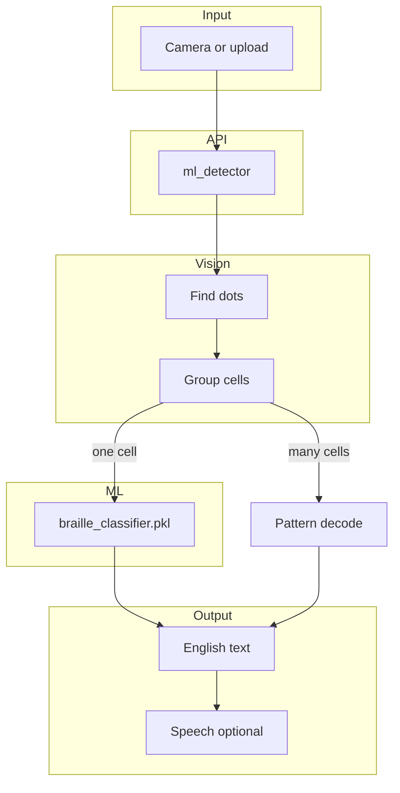

# BrailleVision

BrailleVision turns **physical Braille** on paper into **English text** you can read or hear. Use your phone or webcam to scan embossed or printed dots—no need to copy Unicode Braille characters (`⠓⠑⠇⠇⠕`) from a screen.

The project combines computer vision (finding and grouping dots), machine learning (recognizing single letters), and a simple web interface with optional read-aloud.

**Live app:** [braillevision.onrender.com/app/](https://braillevision.onrender.com/app/)

---

## About

Braille matters for independence and literacy, but many family members, teachers, and coworkers do not read it fluently. BrailleVision is meant to help in everyday situations: checking a label, following along in a classroom, or understanding a note without a dedicated human translator every time.

It is an assistive tool, not a replacement for skilled Braille readers or formal accessibility review.

---

## Features

- **Camera scanning** — live preview, single capture, or continuous live scan
- **Image upload** — one file or a batch of images
- **Physical dot detection** — OpenCV finds round blobs and groups them into standard 6-dot cells
- **Letter recognition** — trained classifier (`models/braille_classifier.pkl`, ~99% on held-out practice data)
- **Word and line decoding** — geometric pattern matching when the camera sees multiple cells
- **Text-to-speech** — optional voice guidance and read-aloud in the browser
- **Accessible UI** — high contrast, large controls, screen-reader-friendly live regions

---

## How it works

### Two recognition paths

| Input | Approach |
|-------|----------|
| **Single-cell image** (one letter in frame) | Machine learning on a 50×50 cell patch |
| **Multi-cell photo** (words or lines) | OpenCV dot detection → cell grouping → Grade 1 pattern decode |

Both are handled in `backend/braille/ml_detector.py`.

### Pipeline



### Dot detection (OpenCV)

1. Contrast enhancement (CLAHE) and thresholding for dark dots and embossed relief  
2. Contour filtering by size and roundness  
3. Horizontal grouping into character cells using estimated dot spacing  
4. Mapping each dot to positions 1–6 in a 2×3 cell, then to Grade 1 English  

### Machine learning

- **Model:** scikit-learn MLP (1024→512→256) with `StandardScaler`  
- **Training:** `scripts/train_model.py`  
- **Runtime:** model loads on the API server; the web app calls REST endpoints (browsers do not load the `.pkl` directly)

---

## Architecture

1. **Data** — merged training sets: *Braille Alphabet Image Dataset (A–Z)* (2,600 PNGs) and *Braille Dataset* (1,560 JPGs), 4,160 labeled cells total  
2. **Training** — augmentation (flip, rotate, noise, blur), Otsu binarization, joblib export to `models/braille_classifier.pkl`  
3. **Vision** — `backend/braille/detector.py`  
4. **Hybrid inference** — `ml_detector.py`  
5. **API** — FastAPI in `backend/main.py` (`/scan`, batch routes, WebSocket, static UI at `/app`)  
6. **Web UI** — `web/` (HTML, CSS, JavaScript)

---

## Design notes

Early versions clustered dot *rows* instead of full *cells*; fixing pitch-based bucketing made multi-letter scans reliable. Single-cell ML works well on clean patches; photo crops look different, so multi-cell lines use geometric decoding. Image loading uses byte buffers and `cv2.imdecode` where file paths are awkward on Windows.

---

## Roadmap

- Grade 2 (contracted) Braille  
- Stronger models on real-world cropped cells (e.g. small CNN)  
- Mobile app with optional on-device inference  
- Glare and blur detection before capture  
- Community-contributed labeled photos  

---

## Table of contents

- [About](#about)
- [Features](#features)
- [How it works](#how-it-works)
- [Architecture](#architecture)
- [Design notes](#design-notes)
- [Roadmap](#roadmap)
- [Problem statement](#problem-statement)
- [Repository layout](#repository-layout)
- [Requirements](#requirements)
- [Quick start](#quick-start)
- [Using the web app](#using-the-web-app)
- [API reference](#api-reference)
- [Training the model](#training-the-model)
- [Training data](#training-data)
- [Accuracy and limitations](#accuracy-and-limitations)
- [Accessibility](#accessibility)
- [Troubleshooting](#troubleshooting)
- [License](#license)

---

## Problem statement

Physical Braille uses raised or ink dots in a 6-dot cell layout. BrailleVision:

1. Detects those dots in a camera image  
2. Groups them into cells (two columns × three rows)  
3. Decodes Grade 1 English  
4. Optionally speaks the result  

---

## Repository layout

```
BrailleVision/
├── models/braille_classifier.pkl
├── web/                    # Web interface
├── backend/
│   ├── main.py
│   └── braille/            # detector, classifier, ml_detector, decoder
├── scripts/
│   ├── train_model.py
│   └── generate_sample_braille.py
├── Braille Alphabet Image Dataset (A-Z)/
├── Braille Dataset/
├── samples/
└── frontend/               # Optional React dev UI
```

---

## Requirements

| Component | Notes |
|-----------|--------|
| Python | 3.10+ (tested on 3.12) |
| Dependencies | `backend/requirements.txt` |
| Browser | Chrome, Edge, or Firefox (camera + speech) |
| Node.js | Optional, only for `frontend/` |

A webcam or phone camera is enough; GPU is not required.

---

## Quick start

### Clone and install

```bash
git clone https://github.com/BoyTiger-1/BrailleVision.git
cd BrailleVision
```

**Windows (PowerShell):**

```powershell
cd backend
python -m venv .venv
.\.venv\Scripts\Activate.ps1
pip install -r requirements.txt
```

**macOS / Linux:**

```bash
cd backend
python3 -m venv .venv
source .venv/bin/activate
pip install -r requirements.txt
```

### Model file

The repository includes `models/braille_classifier.pkl`. If it is missing:

```bash
python scripts/train_model.py --augment 4
```

### Run

```bash
cd backend
python main.py
```

- Web app: http://127.0.0.1:8000/app/  
- API docs: http://127.0.0.1:8000/docs  
- Health: http://127.0.0.1:8000/health  

---

## Using the web app

1. Open `/app/` and allow camera access if prompted.  
2. **Start camera**, align Braille inside the corner guides, then **Scan now** or **Live scan**.  
3. Or **Upload** one or more images.  
4. Read the translation; use **Read aloud** or enable **Voice guidance** in preferences.  
5. Toggle **Detection overlay** to see where dots were found.  

---

## API reference

Base URL: same host as the app (e.g. `http://127.0.0.1:8000`).

| Endpoint | Description |
|----------|-------------|
| `GET /health` | Status and model metrics |
| `GET /model/info` | Model version and classes |
| `POST /scan` | Multipart image upload |
| `POST /scan/base64` | JSON `{ "image": "data:image/...", "include_debug": true }` |
| `POST /scan/batch` | Multiple files |
| `POST /scan/batch/base64` | JSON `{ "images": [...] }` |
| `WS /ws/scan` | Streaming frames |

**Example response:**

```json
{
  "text": "hello",
  "confidence": 0.95,
  "dot_count": 14,
  "cell_count": 5,
  "alignment_hint": "Good alignment. Hold steady for best results.",
  "debug_image": null,
  "per_cell_confidence": [0.99, 0.98, 0.99, 0.99, 0.97]
}
```

---

## Training the model

```bash
python scripts/train_model.py --augment 4 --out models/braille_classifier.pkl
```

| Flag | Meaning |
|------|---------|
| `--augment 4` | Extra training copies per image |
| `--out` | Output path for the joblib bundle |

The script discovers Braille dataset folders in the project root automatically.

**Bundle contents:** sklearn pipeline, label encoder, image size, classes, metrics, dataset list.

**CLI test without server:**

```bash
python backend/run_detect.py samples/braille_hello.png
```

---

## Training data

| Dataset | Location | Count | Format |
|---------|----------|-------|--------|
| Braille Alphabet (A–Z) | `Braille Alphabet Image Dataset (A-Z)/` | 2,600 | PNG 50×50, folder per letter |
| Braille Dataset | `Braille Dataset/Braille Dataset/` | 1,560 | JPG, label = first letter of filename |

Merged training typically reaches **~99%** held-out accuracy on single-cell images.

---

## Accuracy and limitations

| Scenario | What to expect |
|----------|----------------|
| Clean single-letter images | Very high accuracy (ML) |
| Multi-letter synthetic samples | Reliable via pattern decode |
| Real camera, good lighting | Generally good; depends on focus and glare |
| Handwritten Braille | Variable |
| Grade 2 contracted Braille | Not supported yet |
| Unicode Braille text | Not supported (by design) |

Typical latency: about 100–500 ms per frame on a laptop CPU.

---

## Accessibility

- Skip link to main content  
- Large touch targets and high-contrast theme  
- `aria-live` region for new translations  
- Web Speech API for optional read-aloud  
- Alignment hints when detection is weak  

---

## Troubleshooting

| Issue | What to try |
|-------|-------------|
| `Model not found` | Run `python scripts/train_model.py` |
| Camera blocked | Use HTTPS or localhost; check browser permissions |
| Scan failed | Confirm `/health` responds |
| Empty text | Better light, move closer, hold paper flat |
| Wrong letters | Reduce blur; keep paper parallel to the camera |

---

## License

MIT — see [LICENSE](LICENSE).
