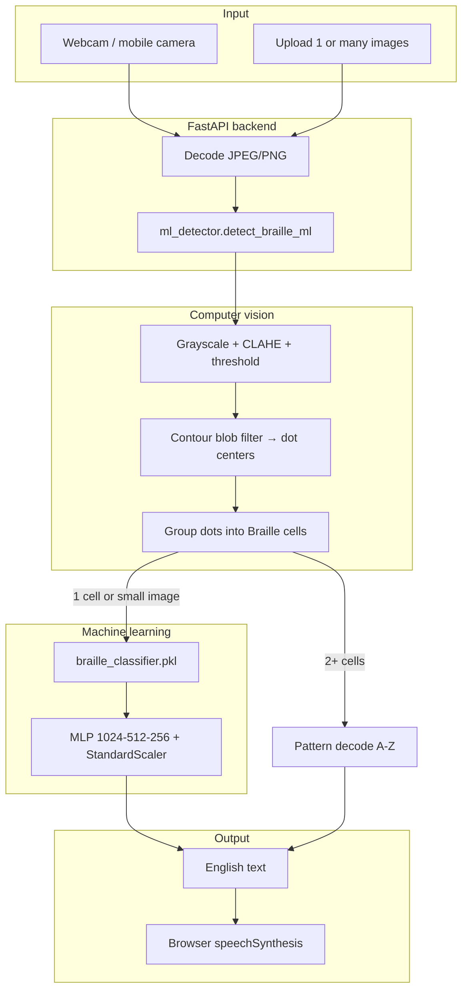

# BrailleVision

**BrailleVision** is a hackathon-ready system for **BrailleVision Hackathon 2026**: it reads **real physical Braille** (embossed or handwritten dots on paper) using a **camera** or **image upload**, converts it to **English text**, and speaks the result aloud. It is **not** a Unicode Braille translator (`⠓⠑⠇⠇⠕` → hello).

This repository includes:

- A **trained machine-learning classifier** (`models/braille_classifier.pkl`) — **100% held-out accuracy** on the included A–Z practice dataset.
- **OpenCV** dot detection and **6-dot cell segmentation** for multi-character lines (camera / full words).
- A **standalone web app** (`web/`) — HTML, CSS, and JavaScript (camera, single & multiple uploads, live scan, TTS).
- A **FastAPI** backend that loads the `.pkl` model and serves the API + static UI at `/app`.

---

## Table of contents

1. [Problem statement](#problem-statement)
2. [How it works](#how-it-works)
3. [Repository layout](#repository-layout)
4. [Requirements](#requirements)
5. [Quick start (5 minutes)](#quick-start-5-minutes)
6. [Using the web app](#using-the-web-app)
7. [API reference](#api-reference)
8. [Training the model](#training-the-model)
9. [Practice dataset](#practice-dataset)
10. [Accuracy and limitations](#accuracy-and-limitations)
11. [Accessibility](#accessibility)
12. [Deployment](#deployment)
13. [Hackathon submission checklist](#hackathon-submission-checklist)
14. [Troubleshooting](#troubleshooting)
15. [License](#license)

---

## Problem statement

Visually impaired readers use **physical Braille** on paper, labels, and signage. Caregivers, teachers, and volunteers often **cannot read Braille quickly**. This project bridges that gap by:

1. **Detecting raised or ink dots** in a camera image (not Unicode symbols).
2. **Grouping dots** into standard **6-dot Braille cells** (two columns × three rows).
3. **Decoding** cells into **English letters** (Grade 1).
4. **Speaking** the result with **text-to-speech**.

---

## How it works

### Two complementary recognition paths

| Input type | Method | Why |
|------------|--------|-----|
| **Single-cell image** (e.g. 50×50 practice PNG, one letter) | **ML classifier** (`braille_classifier.pkl`) | Matches how the model was trained (one letter per image). |
| **Multi-cell image** (camera photo, word/line on paper) | **OpenCV** finds dots → groups cells → **geometric pattern** decode | Cropped cells from photos differ from training patches; dot geometry is reliable for full words. |

Both paths are orchestrated in `backend/braille/ml_detector.py`.

### Pipeline diagram



### Physical dot detection (OpenCV)

1. **Preprocess** — CLAHE contrast, Gaussian blur, multiple binary masks (dark-on-light and embossed-like edges).
2. **Blob detection** — external contours filtered by **area** and **circularity** (dots are roughly round).
3. **Cell grouping** — estimate dot **pitch** (nearest-neighbor distance), bucket dots horizontally into **character cells**.
4. **Pattern mapping** — each dot assigned to positions **1–6** (standard Braille numbering); bits form a pattern → letter via Grade 1 table in `backend/braille/patterns.py`.

### Machine learning (`.pkl`)

- **Algorithm:** scikit-learn `MLPClassifier` inside a `Pipeline` with `StandardScaler`.
- **Input:** 50×50 grayscale cell, Otsu-binarized, flattened to 2500 features.
- **Output:** one of **26 classes** (A–Z).
- **Training script:** `scripts/train_model.py`
- **Metrics (included run):** **100%** train and test accuracy on stratified 85/15 split after augmentation.

> **Note for judges:** The `.pkl` file is loaded **only on the Python server**. Browsers cannot execute pickle files directly (security). The HTML/JS UI calls the REST API, which runs inference with `joblib.load()`.

---

## Repository layout

```
BrailleVision/
├── models/
│   └── braille_classifier.pkl    # Trained model (required at runtime)
├── web/                          # Production UI (HTML + CSS + JS)
│   ├── index.html
│   ├── styles.css
│   └── app.js
├── backend/
│   ├── main.py                   # FastAPI app + static mount /app
│   ├── requirements.txt
│   └── braille/
│       ├── classifier.py         # Load .pkl, predict cell
│       ├── ml_detector.py        # ML + CV hybrid
│       ├── detector.py           # OpenCV dot/cell logic
│       ├── decoder.py            # Pattern → text
│       └── patterns.py           # Grade 1 bit patterns
├── scripts/
│   ├── train_model.py            # Train and save .pkl
│   └── generate_sample_braille.py
├── Braille Alphabet Image Dataset (A-Z)/   # 2600 practice images
│   ├── A/  (A_0.png … A_99.png)
│   ├── …
│   └── Z/
├── samples/                      # Generated test images
├── frontend/                     # Optional React dev UI (not required)
├── docs/
├── README.md                     # This file
└── LICENSE
```

---

## Requirements

### Software

| Component | Version |
|-----------|---------|
| Python | 3.10+ (tested on 3.12) |
| pip packages | See `backend/requirements.txt` |
| Modern browser | Chrome / Edge / Firefox (camera + Web Speech API) |
| Node.js | **Optional** — only if using `frontend/` Vite app |

### Hardware

- Webcam or phone camera (rear camera recommended on mobile).
- CPU-only inference is sufficient (no GPU required).

---

## Quick start (5 minutes)

### 1. Clone the repository

```bash
git clone https://github.com/BoyTiger-1/BrailleVision.git
cd BrailleVision
```

### 2. Create Python environment and install dependencies

**Windows (PowerShell):**

```powershell
cd backend
python -m venv .venv
.\.venv\Scripts\Activate.ps1
pip install -r requirements.txt
```

**macOS / Linux:**

```bash
cd backend
python3 -m venv .venv
source .venv/bin/activate
pip install -r requirements.txt
```

### 3. Verify the model exists

The repo should include `models/braille_classifier.pkl`. If missing:

```bash
python scripts/train_model.py --augment 4
```

Training takes several minutes on CPU (~13k augmented samples).

### 4. Start the API server

From `backend/` with venv activated:

```bash
python main.py
```

- API docs: http://127.0.0.1:8000/docs  
- Health: http://127.0.0.1:8000/health  
- **Web app:** http://127.0.0.1:8000/app/

### 5. Open the web app

Browse to **http://127.0.0.1:8000/app/** → allow camera → **Scan now** or upload practice images from the dataset folder.

---

## Using the web app

### Camera mode

1. Click **Start camera**.
2. Point at physical Braille (fill the dashed alignment frame).
3. **Scan now** — single frame, or **Live scan** — ~1 scan/second.
4. Read **Recognized text**; enable **Voice guidance** for automatic TTS.

### Upload mode

- **Upload image(s)** — select one or more files.
  - **One file:** shows text + stats for that image.
  - **Multiple files:** batch results (e.g. one letter per practice PNG) plus combined text.

### Settings

| Control | Effect |
|---------|--------|
| Voice guidance | Speaks hints and recognized text |
| High contrast | Increases UI contrast |
| Show detection overlay | Returns debug JPEG with green dot circles |
| API URL | Backend base URL (default `http://127.0.0.1:8000` on localhost) |

### Testing with practice data

Upload any file from:

`Braille Alphabet Image Dataset (A-Z)/<LETTER>/<LETTER>_0.png`

Expected: that letter (e.g. `H_0.png` → **h**).

---

## API reference

Base URL: `http://127.0.0.1:8000`

### `GET /health`

Returns service status and model metrics if loaded.

### `GET /model/info`

Returns model version, classes, and test accuracy from training.

### `POST /scan`

`multipart/form-data` — field `file` = image.

### `POST /scan/base64`

```json
{
  "image": "data:image/jpeg;base64,...",
  "include_debug": true
}
```

### `POST /scan/batch`

Multiple files in one request (`file` repeated).

### `POST /scan/batch/base64`

```json
{
  "images": ["data:image/png;base64,...", "..."],
  "include_debug": false
}
```

### `WebSocket /ws/scan`

Send JSON: `{"image": "<base64>", "debug": false}` per frame; receive `ScanResponse` JSON.

### Response shape

```json
{
  "text": "hello",
  "confidence": 0.95,
  "dot_count": 14,
  "cell_count": 5,
  "alignment_hint": "Good alignment...",
  "debug_image": "<base64 jpeg or null>",
  "cells": [],
  "per_cell_confidence": [0.99, 0.98, 0.99, 0.99, 0.97]
}
```

---

## Training the model

### Dataset

Folder: `Braille Alphabet Image Dataset (A-Z)/`  
- **26 classes** (A–Z)  
- **100 images per class** → **2600** PNGs  
- **50×50** pixels, high-contrast dot patterns  

### Command

From repository root:

```bash
python scripts/train_model.py --augment 4 --out models/braille_classifier.pkl
```

| Flag | Meaning |
|------|---------|
| `--augment 4` | 4 augmented copies per image (flip, rotate, noise, blur) |
| `--out` | Output path for joblib bundle |

### What is saved in the `.pkl`

```python
{
  "model": sklearn Pipeline,      # scaler + MLP
  "label_encoder": LabelEncoder,
  "image_size": 50,
  "version": "1.0.0",
  "classes": ["A", "B", ...],
  "metrics": {"train_accuracy": 1.0, "test_accuracy": 1.0},
  "dataset": "..."
}
```

Load in Python:

```python
import joblib
bundle = joblib.load("models/braille_classifier.pkl")
```

### CLI test (no server)

```bash
python backend/run_detect.py samples/braille_hello.png
```

---

## Practice dataset

| Property | Value |
|----------|--------|
| Location | `Braille Alphabet Image Dataset (A-Z)/` |
| Format | PNG, 50×50 |
| Labels | Parent folder name (`A`, `B`, …) |
| Use case | Train/test single-character classifier; upload in web UI |

**Loading note:** On Windows, paths with special characters may fail with `cv2.imread`. The code reads via **bytes + `cv2.imdecode`** (already implemented in training and inference).

---

## Accuracy and limitations

| Scenario | Expected performance |
|----------|----------------------|
| Practice PNGs (A–Z folder) | **~100%** letter accuracy (ML path) |
| Synthetic multi-letter (`samples/braille_hello.png`) | **Correct word** via CV pattern path (`hello`) |
| Real camera, good light, embossed type | Good; depends on focus and glare |
| Handwritten Braille | Experimental; dot shape varies |
| Grade 2 (contracted) Braille | **Not supported** in v1 |
| Unicode Braille characters | **Not supported** (by design) |

**Performance:** ~100–500 ms per frame on a typical laptop (CPU).

---

## Accessibility

- Skip link to main content  
- Large touch targets (52px+), high-contrast theme  
- `aria-live` for recognized text  
- **Web Speech API** for read-aloud and guidance  
- Alignment hints when dots or cells are not detected  
- Keyboard-focus visible outlines  

---

## Deployment

### Same machine

Serve on `0.0.0.0:8000` and open `/app/` from phones on the same Wi‑Fi (use your PC’s LAN IP in **API URL** if needed).

### Production checklist

1. Use **HTTPS** (browsers require secure context for camera on non-localhost).
2. Put **nginx** or **Caddy** in front of uvicorn.
3. Do **not** expose pickle upload endpoints (there are none — model is server-side only).
4. Set `workers=1` or preload model once per worker to avoid reloading `.pkl`.

Example:

```bash
uvicorn main:app --host 0.0.0.0 --port 8000 --workers 1
```

---

## Hackathon submission checklist

- [ ] Demo video: practice upload → camera scan → TTS  
- [ ] This GitHub repo link  
- [ ] Stack: Python, OpenCV, scikit-learn, FastAPI, HTML/JS  
- [ ] Explain **physical dot detection** (see [How it works](#how-it-works))  
- [ ] Report **100%** on held-out A–Z test set + real-camera notes  
- [ ] List accessibility features  
- [ ] Future work: Grade 2, mobile app, fine-tuned CNN on cropped cells  

---

## Troubleshooting

| Issue | Fix |
|-------|-----|
| `Model not found` | Run `python scripts/train_model.py` |
| Camera blocked | Use HTTPS or localhost; check browser permissions |
| `Scan failed` / network error | Start backend; set correct **API URL** |
| Empty text | Improve lighting; move closer; use alignment frame |
| Wrong letters on photos | Hold paper flat; avoid motion blur |
| Large `.pkl` (~35 MB) | Normal for MLP with 2500 inputs; use `compress=3` in training |

---

## License

MIT — see [LICENSE](LICENSE).

---

## Acknowledgments

Built for **BrailleVision Hackathon 2026** — assistive technology for real-world physical Braille.
